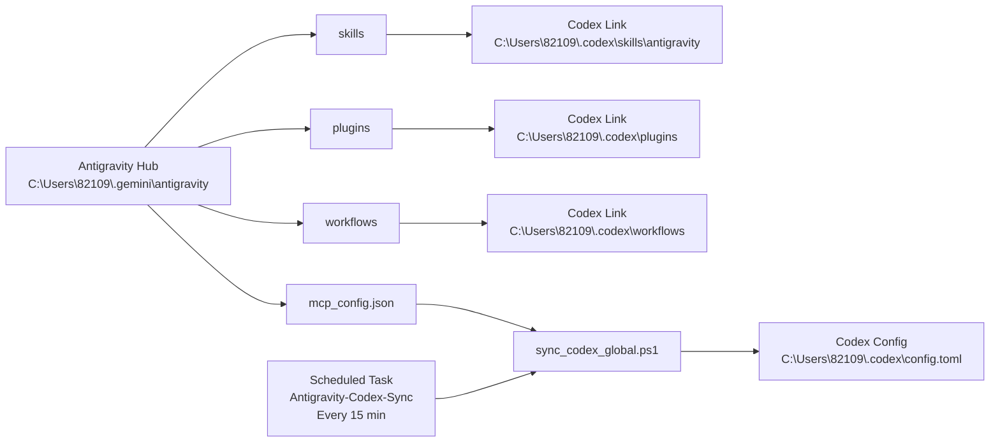

# Google Antigravity x Codex 전역 공유 세팅 가이드 (왕초보 실전판)

## 0) 이 문서가 왜 중요한가
처음 설치한 사람은 보통 "스킬은 어디에 넣지?", "MCP는 어디를 수정하지?", "왜 세션마다 다르게 보이지?"에서 막힙니다.
이 가이드는 **한 폴더를 허브로 써서 모든 세션에서 공용으로 쓰는 방식**을 설명합니다.

핵심 한 줄:
- `C:\Users\82109\.gemini\antigravity`를 **중앙 창고(허브)** 로 쓰고, Codex가 그 창고를 **링크로 바라보게** 만들면 됩니다.

---

## 1) 당신이 던진 요청, 한 문장으로
"Antigravity 폴더에 Skills/Plugin/Workflow/MCP를 넣으면 Codex도 모든 세션에서 전역으로 같이 쓰게 세팅해줘."

이 요청은 정확히 맞는 방향입니다.

샘플 프롬프트:

```
내 C:\Users\82109\.gemini\antigravity 폴더에 이 프로그램인 Google Antigravity가 설치되어 있는데, 여기에 하위폴더도 만들어서 Skills 폴더를 만들어서 넣어놓거나 Plugin 폴더를 만들어서 넣어놓거나 Workflow 폴더를 만들어서 넣어놓거나 혹은 MCP 파일 JSON 파일도 여기에 넣어놓는 등등을 하면 Google Antigravity가 모든 세션 채팅창에서 글로벌로 별도로 프로젝트 폴더를 열지 않아도 "네가 가진 스킬스 OO으로 XX를 해"같은거를 할 수 있게 디폴트로 되어있어. 그걸 너도 같이 공용으로 할 수 있게 세팅해줘.
```

---

## 2) 쉬운 비유로 이해하기
비유: **히드라 머리 + 공용 창고**
- 머리 1: Google Antigravity
- 머리 2: Codex
- 몸통(공용 창고): `C:\Users\82109\.gemini\antigravity`

둘이 서로 다른 앱처럼 보여도, 같은 창고를 보게 연결하면
- 스킬 추가
- 워크플로우 추가
- MCP 설정 변경
이 "한 번 작업"으로 둘 다 반영됩니다.

---

## 3) 구조도 (Mermaid)


---

## 4) 실제 폴더 트리
```text
C:\Users\82109\.gemini\antigravity
├─ skills\
├─ plugins\
├─ workflows\
├─ mcp_config.json
├─ sync_codex_global.ps1
├─ CODEX_SHARED_SETUP.md
└─ ANTIGRAVITY_BEGINNER_GLOBAL_SHARE_GUIDE.md

C:\Users\82109\.codex
├─ skills\
│  ├─ .system\
│  └─ antigravity -> (Junction) C:\Users\82109\.gemini\antigravity\skills
├─ plugins -> (Junction) C:\Users\82109\.gemini\antigravity\plugins
├─ workflows -> (Junction) C:\Users\82109\.gemini\antigravity\workflows
└─ config.toml   (MCP 반영 대상)
```

---

## 5) 내가 실제로 적용한 작업 요약
1. 공용 폴더 생성
- `skills`, `plugins`, `workflows`

2. Codex 쪽 링크(Junction) 연결
- Codex가 Antigravity 폴더를 직접 참조하게 구성

3. MCP 동기화 스크립트 생성
- `mcp_config.json` -> `~\.codex\config.toml` 자동 반영

4. 자동 동기화 스케줄러 생성
- 작업 이름: `Antigravity-Codex-Sync`
- 주기: 15분
- 최근 실행 결과: `0` (성공)

---

## 6) 왕초보용 "한 번에 따라하기"

### Step A. 허브 폴더 준비
아래가 존재해야 합니다.
- `C:\Users\82109\.gemini\antigravity\skills`
- `C:\Users\82109\.gemini\antigravity\plugins`
- `C:\Users\82109\.gemini\antigravity\workflows`

### Step B. MCP 원본 수정
- 파일: `C:\Users\82109\.gemini\antigravity\mcp_config.json`
- 여기에 MCP 서버를 추가/수정합니다.

### Step C. 즉시 반영(수동 동기화)
```powershell
powershell -NoProfile -ExecutionPolicy Bypass -File C:\Users\82109\.gemini\antigravity\sync_codex_global.ps1
```

### Step D. 자동 반영 확인
```powershell
schtasks /Query /TN "Antigravity-Codex-Sync" /V /FO LIST
```
- `Last Result: 0`이면 정상입니다.

---

## 7) 스킬 추가 실전 예시

스킬 폴더 형태:
```text
C:\Users\82109\.gemini\antigravity\skills\my-skill\SKILL.md
```

채팅에서 호출 예:
- "`my-skill`로 XX 작업해줘"
- 또는 스킬 규칙에 맞는 이름/호출 방식 사용

주의:
- 이미 열려 있는 세션은 캐시 때문에 즉시 인식이 늦을 수 있습니다.
- 이때는 새 세션을 열면 가장 확실합니다.

---

## 8) 자주 헷갈리는 포인트

1. "왜 profiles 훅 대신 스케줄러를 썼나?"
- PC의 PowerShell 실행 정책 때문에 프로필 자동 실행이 막히는 경우가 있습니다.
- 스케줄러는 `-ExecutionPolicy Bypass`로 안정적으로 동작합니다.

2. "mcp_config.json 바꿨는데 Codex가 바로 모른다"
- 최대 15분까지 대기될 수 있습니다.
- 즉시 반영하려면 수동 동기화 명령 1번 실행하세요.

3. "plugins/workflows는 Codex가 직접 읽나?"
- 기능 자체는 도구 구현에 따라 다르지만, **파일 저장소는 공용화**되어 둘 다 같은 내용을 봅니다.

---

## 9) 초보가 그대로 복붙할 프롬프트 템플릿

### 템플릿 1: 최초 세팅
"내 `C:\Users\<사용자명>\.gemini\antigravity`를 공용 허브로 쓰고 싶어. Codex가 `skills/plugins/workflows`를 전역 공유하도록 링크 만들고, `mcp_config.json`을 `~\.codex\config.toml`로 자동 동기화까지 세팅해줘. 마지막에 검증 결과도 보여줘."

### 템플릿 2: MCP 추가 후 반영
"`C:\Users\<사용자명>\.gemini\antigravity\mcp_config.json`을 기준으로 Codex MCP를 지금 즉시 동기화하고, `codex mcp list` 결과까지 확인해줘."

### 템플릿 3: 스킬 배포
"`C:\Users\<사용자명>\.gemini\antigravity\skills\<skill-name>`에 스킬 구조를 만들어주고, 호출 테스트 방법까지 정리해줘."

---

## 10) 최종 체크리스트
- [ ] `antigravity`에 `skills/plugins/workflows` 폴더가 있다.
- [ ] `~\.codex`에 3개 Junction 링크가 연결되어 있다.
- [ ] `sync_codex_global.ps1`가 존재한다.
- [ ] 스케줄 작업 `Antigravity-Codex-Sync`가 Enabled 상태다.
- [ ] `mcp_config.json` 수정 후 `codex mcp list`에 반영된다.

이 5개만 되면, 당신이 원한 "히드라 공용화"는 완료입니다.
