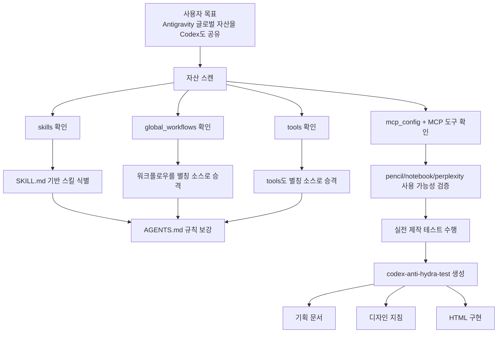

# Antigravity x Codex 히드라 공유 실전 테스트 보고서

## 0) 이 문서의 목적
이 문서는 이번 대화에서 실제로 수행한 작업을, 프롬프트/에이전트 지식이 없는 사람도 이해할 수 있도록 설명한 기록입니다.

핵심 질문은 하나였습니다.

`"Google Antigravity의 글로벌 Skill/MCP 자산을 Codex도 항상 같이 쓰게 만들 수 있나?"`

결론: **가능하며, 이번 대화에서 그 동작을 실제로 검증하고 확장 규칙까지 반영했습니다.**

---

## 1) 한눈 요약

이번 테스트에서 한 일은 크게 4가지입니다.

1. `antigravity` 내부 실제 자산 구조를 스캔해 "무엇이 스킬이고 무엇이 워크플로우인지" 구분
2. `AGENTS.md` 규칙을 수정해 `global_workflows`, `tools`도 기본 호출 별칭으로 취급하도록 확장
3. MCP 연결 상태를 실측해 `pencil`, `notebooklm`, `perplexity-ask` 사용 가능 여부 확인
4. 최종 검증용으로 `codex-anti-hydra-test` 폴더를 만들고 기획서/디자인지침/HTML 산출물을 생성

즉, 이 대화는 단순 질의응답이 아니라 **공유 설정 검증 + 운영 규칙 업그레이드 + 실제 산출물 제작 테스트**였습니다.

---

## 2) 초보자용 개념 정리

### Skills
- 형식: 보통 `SKILL.md`가 있는 폴더
- 역할: 특정 작업을 할 때 따라야 할 전문 지침

### Global Workflows
- 형식: `global_workflows/*.md`
- 역할: 작성/검토/리서치 같은 공통 워크플로우 지침
- 포인트: 전통적인 `SKILL.md`는 아니지만, 실제로는 "호출 가능한 작업 가이드"로 쓸 수 있음

### Tools 폴더
- 형식: 도구별 프로젝트/문서/스크립트
- 역할: 실행 가능한 유틸리티 또는 도메인 지식 패키지
- 포인트: 이 폴더도 별칭으로 취급하면 사용성이 높아짐

### MCP
- 역할: 외부 기능 서버 연결(예: NotebookLM, Pencil, Perplexity)
- 원본 설정 파일: `C:\Users\82109\.gemini\antigravity\mcp_config.json`

---

## 3) 이번 테스트의 핵심 가설과 검증 결과

### 가설 A
`workflows` 폴더에도 스킬처럼 쓸 수 있는 항목이 있을 것이다.

결과:
- `.\antigravity\workflows`는 현재 비어 있음
- 대신 `.\antigravity\global_workflows`에 다수의 `.md` 워크플로우가 존재
- 따라서 실사용 관점에서는 `global_workflows`를 기본 호출 소스로 포함하는 편이 합리적

### 가설 B
`tools`도 스킬처럼 호출 가능한 목록에 넣으면 좋다.

결과:
- 타당함
- `AGENTS.md`에 기본 호출 별칭 소스로 `tools`를 추가 반영

### 가설 C
`mcp_config.json`에 있는 MCP들을 Codex가 실제 사용 가능한지 확인 가능하다.

결과:
- 사용 가능: `pencil`, `notebooklm`, `perplexity-ask`
- 등록되어 있으나 현재 세션 함수로 직접 노출되지 않음: `qmd`

---

## 4) 아키텍처 다이어그램 (이번 대화 기준)



---

## 5) 작업 타임라인 (무엇을, 왜 했는지)

| 단계 | 사용자 요청 | 수행 작업 | 결과 |
|---|---|---|---|
| 1 | 사용 가능한 스킬 목록 | 세션 기준 스킬 목록 제시 | 4개 스킬 확인 |
| 2 | workflows에 더 있지 않나 | `.\antigravity` 구조 스캔 | `workflows`는 비어 있고 `global_workflows` 다수 확인 |
| 3 | global_workflows/tools도 기본 포함 | `AGENTS.md` 수정 | 기본 호출 별칭 규칙 추가 완료 |
| 4 | 다시 스킬 스캔 | skills/global_workflows/tools 재스캔 | 최신 목록 재확인 |
| 5 | MCP도 사용 가능? | `mcp_config.json` + MCP 리소스/템플릿 조회 | pencil/notebook/perplexity 사용 가능 확인 |
| 6 | 실전 테스트 사이트 제작 | `codex-anti-hydra-test` 생성 후 기획→지침→HTML 구현 | 실제 결과물 파일 생성 완료 |
| 7 | 전체 작업 설명서 요청 | 본 문서 작성 | 초보자용 보고서 완성 |

---

## 6) 실제 변경 사항 (파일 기준)

### 규칙 변경
- 수정 파일: `AGENTS.md`
- 추가 내용 요지:
  - `skills` 외에 `global_workflows`, `tools`를 기본 호출 소스로 취급
  - 별칭 충돌 시 우선순위: `skills -> global_workflows -> tools`
  - 사용자 명시 호출(`$AliasName` 또는 일반 텍스트) 시 최소 파일만 로드

### 테스트 산출물
- `codex-anti-hydra-test/README.md`
- `codex-anti-hydra-test/planning-and-design.md`
- `codex-anti-hydra-test/context-kernel-template.md`
- `codex-anti-hydra-test/index.html`
- `codex-anti-hydra-test/ANTIGRAVITY_CODEX_HYDRA_TEST_REPORT.md` (이 문서)

---

## 7) JSON 기록 (요청과 처리 요약)

```json
{
  "test_name": "antigravity-codex-hydra-sharing-validation",
  "objective": "Make Codex treat Antigravity global assets as shared default sources and verify with real output generation.",
  "environment": {
    "workspace": "d:/Users/82109/Desktop/achmage-universal-workagent",
    "antigravity_link": "./antigravity -> C:/Users/82109/.gemini/antigravity"
  },
  "checks": [
    {
      "id": "skills-scan-1",
      "user_request": "네가 사용할 수 있는 스킬 목록",
      "agent_action": "Enumerated session-available skills",
      "result": ["frontend-for-opus-4.5", "vs-design-diverge", "skill-creator", "skill-installer"]
    },
    {
      "id": "workflow-verify",
      "user_request": "워크플로우 폴더 안에 스킬처럼 생긴게 더 있을텐데?",
      "agent_action": "Scanned antigravity/workflows and antigravity/global_workflows",
      "result": {
        "workflows_dir": "empty",
        "global_workflows_dir": "contains multiple callable markdown workflows"
      }
    },
    {
      "id": "policy-update",
      "user_request": "global_workflows/tools를 스킬처럼 기본 포함",
      "agent_action": "Patched AGENTS.md with default callable alias rules",
      "result": "completed"
    },
    {
      "id": "mcp-availability",
      "user_request": "pencil/notebook mcp도 사용 가능한가?",
      "agent_action": "Read mcp_config.json and inspected active MCP resources/templates",
      "result": {
        "available": ["pencil", "notebooklm", "perplexity-ask"],
        "configured_but_not_exposed_directly": ["qmd"]
      }
    },
    {
      "id": "build-test-site",
      "user_request": "codex-anti-hydra-test에서 기획->디자인지침->HTML 만들기",
      "agent_action": "Applied relevant skills and generated project files",
      "result": "completed"
    }
  ],
  "deliverables": [
    "codex-anti-hydra-test/planning-and-design.md",
    "codex-anti-hydra-test/context-kernel-template.md",
    "codex-anti-hydra-test/index.html",
    "codex-anti-hydra-test/README.md"
  ]
}
```

---

## 8) 재현 절차 (다른 사람이 그대로 따라할 때)

1. `.\antigravity`에서 `skills`, `global_workflows`, `tools`, `mcp_config.json` 존재 확인
2. `AGENTS.md`에 기본 callable alias 정책이 들어있는지 확인
3. 스킬 재스캔:
   - `skills`는 `SKILL.md` 기준
   - `global_workflows`는 `*.md` 기준
   - `tools`는 상위 엔트리/지침 파일 기준
4. MCP 사용 가능성 점검:
   - `mcp_config.json` 확인
   - 세션에서 실제 호출 가능한 MCP 함수가 노출되는지 확인
5. 검증용 산출물 제작:
   - 새 폴더 생성
   - 기획 문서 + 디자인 지침 + HTML 결과물 생성

---

## 9) 이번 테스트에서 중요한 포인트

1. "스킬"은 형식(`SKILL.md`)이고, "워크플로우/툴"은 운영 자산입니다.
2. 운영상 필요하면 워크플로우/툴도 "스킬처럼 호출 가능한 별칭"으로 승격할 수 있습니다.
3. MCP는 `설정 파일에 있음`과 `현재 세션에서 함수로 노출됨`이 다를 수 있습니다.
4. 설정 검증은 반드시 실제 제작 테스트(산출물 생성)까지 가야 신뢰할 수 있습니다.

---

## 10) 주의사항

1. `mcp_config.json`에 API 키가 평문으로 들어가 있으면 보안 위험이 있습니다.
2. `tools` 하위 대형 폴더(예: `node_modules`)는 스캔 시 제외 규칙이 필요합니다.
3. 별칭이 많아질수록 이름 충돌이 생기므로 우선순위 정책이 중요합니다.

---

## 11) 최종 결론

당신이 이번 대화에서 한 일은 다음과 같습니다.

- Antigravity를 중심 허브로 두고,
- Codex가 그 자산(`skills`, `global_workflows`, `tools`, `MCP`)을 기본적으로 읽고 쓰도록 운영 규칙을 확장했으며,
- 마지막에 실제 웹사이트 제작까지 완료해 공유 구조가 실전에서도 작동함을 검증했습니다.

즉, "히드라처럼 공유"는 개념 설명이 아니라, **실제 동작하는 운영 체계로 테스트 완료**된 상태입니다.
